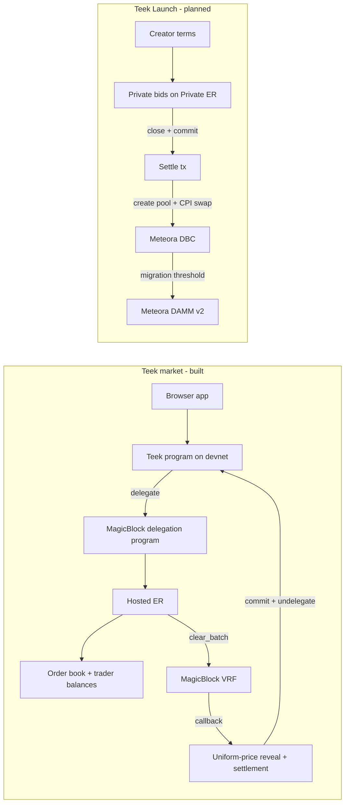

# Teek — Project Overview

_Last updated: 2026-10-04. Status labels: **Verified** = built and proven by a test or on-chain run (evidence listed); **Built** = implemented, not yet proven end to end; **Planned** = scheduled for the event week; **Out of scope** = deliberately not doing now._

---

## 1. Summary

**Teek** is a sealed, uniform-price batch auction engine on Solana, built on MagicBlock Ephemeral Rollups (ER) and MagicBlock VRF. Orders collected during a batch window all execute at **one clearing price**, so arriving first or reacting faster buys nothing inside a batch.

- **What exists today (Sept 2026 build):** a deployed devnet program where traders deposit funds, submit orders into MagicBlock's hosted ER, and clear each batch at one price using real VRF randomness, then commit results back to Solana. A browser demo shows a sniper bot profiting on a continuous order book and failing on Teek, plus a live panel that drives the real devnet flow.
- **What it is becoming (Crypto World's Fair, Oct 2026):** **Teek Launch** — the fair-entry layer for Meteora DBC token launches. Buyers bid privately during a window; at close, everyone's accepted funds make a single opening purchase of the bonding curve, in the same transaction that creates the pool, so every buyer pays the same average price and no bot can trade first.

**Customer promise (launch product):** _Bid privately. Everyone pays one price. Funds move only under the launch terms you accepted._

**History:** started 2026-09-09 for MagicBlock's Solana Blitz v8 (not submitted). Pivot to the launch product decided 2026-10-03/04. Prior work will be disclosed in every submission.

---

## 2. Status at a glance

| Area | Status | Evidence |
|---|---|---|
| Uniform-price clearing engine (Rust + TypeScript) | Verified | 12 Rust + 16 TS tests passing (2026-10-04) |
| Split-resistant, exact pro-rata allocation | Verified (locally) | Adversarial tests + Rust/TS parity; not yet redeployed to devnet |
| Anchor program deployed on devnet | Verified | Program `B6eqSCBh…PkY`; deployed binary hash matched local build |
| Balance custody, locking, settlement | Verified | Devnet VRF test with funded traders |
| Real MagicBlock VRF (async request → oracle callback) | Verified | Devnet test; hosted-ER test with ephemeral VRF queue |
| Delegation to MagicBlock ER | Verified | Devnet delegation test (ownership moves to delegation program) |
| Full hosted-ER lifecycle (delegate → trade → clear → commit/undelegate) | Verified | `tests/tick.hosted-er.ts` passing (~70 s) |
| Browser demo against hosted ER (manual click-through) | Verified | Recorded in `tick/PLAN.md` |
| One-click "Run Live Demo" button | Built | Wired up; its own end-to-end run is not recorded |
| Private (confidential) orders/bids | **Planned** | Not implemented: the ER order book is currently readable via RPC |
| Meteora DBC atomic pool creation + first buy | Verified (SDK spike) | Devnet tx `5ZEqA9…` |
| Teek Launch program (escrow, settle via DBC CPI, claims, refunds) | Planned | Spec in `tick/LAUNCH_SPEC.md` |
| Mainnet deployment | Out of scope (undecided) | Required by Solami track; costs real SOL |

---

## 3. The problem

1. **Continuous markets reward speed, not information or price.** When the fair value moves, the fastest trader picks off stale quotes. That profit is a tax on everyone else, not a reward for better prices.
2. **Token launches are won in the first block.** Bots buy the cheapest point of a bonding curve before humans can react; retail buys their exit.
3. **Fixed-price sales misprice demand.** Pro-rata sales at a fixed price are routinely oversubscribed — e.g. MetaDAO's Rip Cars ICO took $31.9M of commitments against a $250K cap, so a $1,000 commitment received ~$7.80 of tokens. Underpricing pushes the real price discovery into the first minutes of public trading, which bots win again.
4. **Meteora DBC lacks a fair entry tool.** Meteora's Alpha Vault (pooled pre-launch buying at one average price) lists support for DLMM, DAMM v1 and DAMM v2 — not DBC, Meteora's launch product. (To confirm with Meteora's team.)

---

## 4. How Teek works

### 4.1 Uniform-price batch auction
- Orders arrive during a window measured in slots; after it closes, `submit_order` rejects new orders (`BatchSealed`).
- The clearing price is chosen from submitted limit prices: maximize matched volume; among ties, minimize the buy/sell imbalance; any remaining tie is broken with VRF randomness (so the price can't be steered by clustering orders at one tick).
- Every fill executes at that one price. No buy fills above its limit; no sell fills below its limit.

### 4.2 Fair allocation (rationing the long side)
- When one side has more volume than can be matched, each eligible order gets the floor of its exact pro-rata share, and leftover units go out by **dependent (systematic) randomized rounding**: each order's _expected_ fill is exactly `qty × available / total`.
- Consequence: splitting an order into many — in one wallet or across many wallets — cannot raise its expected fill. (The previous largest-remainder method could: with 2 units and bids of 2 and 1, splitting the 2 into 1+1 raised the splitter's expected fill from 1 to 4/3.)
- Exact integer (u128 / BigInt) arithmetic. The previous floating-point formula misallocated units at realistic token amounts (~10^15 base units; reproduced in 3 of 7 random trials).
- Orders priced better than the clearing price are rationed pro-rata together with marginal ones (no price priority). This is a deliberate choice for the batch market; revisit if limit-price launch bids are added.

### 4.3 Randomness: MagicBlock VRF
- `clear_batch` does not clear. It seals the batch (`awaiting_vrf` guard blocks new orders) and requests randomness from MagicBlock's VRF oracle.
- The oracle later invokes `clear_batch_callback` with 32 random bytes; only then does clearing run. This is MagicBlock's own `roll-dice` pattern, because no single transaction can both request and use VRF output.
- Accepted oracle queues: base-layer `DEFAULT_QUEUE`, `DEFAULT_EPHEMERAL_QUEUE` (inside the ER), and the local `DEFAULT_TEST_QUEUE`.

### 4.4 Custody and settlement
- Each trader has a `TraderAccount` PDA per market holding base/quote balances deposited into the market's SPL vaults.
- `submit_order` locks the order's worst case (`price × qty` quote for a buy, `qty` base for a sell) and rejects orders that can't be covered.
- `clear_batch_callback` releases every lock and applies each fill at the clearing price (buyers pay `qty × clearing price`, not their limit), looking up each trader's account among the remaining accounts passed in.
- Each trader account is located by its canonical PDA (not by position in the account list), so whoever cranks the batch can't settle an order against the wrong trader by reordering or substituting accounts. All arithmetic is checked (`Overflow` error).
- `withdraw_base` / `withdraw_quote` pay out only unlocked balance.

### 4.5 Real-time execution on MagicBlock ER
- `delegate_accounts` hands `market`, `order_book` and `reveal` to MagicBlock's delegation program; `delegate_trader_account` does the same for each trader's balance account (it is written by `submit_order`, so it must live on the same ER).
- Orders and clearing then run on MagicBlock's hosted devnet ER via `ConnectionMagicRouter` (`https://devnet-us.magicblock.app/`).
- `commit_and_undelegate` commits all mutated accounts back to Solana and returns ownership.
- Note: once delegated, the ER clock runs ahead of devnet's slot, so a batch is reopened on the ER clock before trading.

---

## 5. Features

### 5.1 On-chain program (`programs/tick`, Anchor 1.2.0)

| Instruction | What it does | Status |
|---|---|---|
| `initialize_market(batch_period_slots)` | Creates market PDA, base/quote vaults, zero-copy order book and reveal | Verified |
| `init_trader_account` | Creates a trader's balance PDA for a market | Verified |
| `deposit_base` / `deposit_quote` | Moves SPL tokens into the market vaults, credits the trader account | Verified |
| `withdraw_base` / `withdraw_quote` | Withdraws unlocked balance | Built (not exercised in the recorded runs) |
| `delegate_accounts(base_mint, quote_mint, validator)` | Delegates market / order book / reveal to the ER (optional validator pin) | Verified |
| `delegate_trader_account(market, validator)` | Delegates one trader's balance PDA | Verified |
| `submit_order(side, price, qty)` | Appends an order to the current batch and locks funds | Verified |
| `clear_batch` | Seals the batch and requests VRF randomness | Verified |
| `clear_batch_callback(randomness)` | Oracle-only: clears, writes `Reveal`, settles balances, opens next batch | Verified |
| `commit_and_undelegate` | Commits market/book/reveal/trader accounts to L1 and undelegates | Verified |

**Accounts and PDA seeds**

| Account | Seeds | Notes |
|---|---|---|
| `Market` | `["market", base_mint, quote_mint]` | authority, mints, batch period, open slot, batch id, bumps |
| Base / quote vault | `["base_vault", market]`, `["quote_vault", market]` | SPL token accounts owned by the market PDA |
| `OrderBook` (zero-copy) | `["order_book", market]` | up to 128 orders per batch; `awaiting_vrf` guard |
| `Reveal` (zero-copy) | `["reveal", market]` | last batch's clearing price, matched qty, up to 128 fills |
| `TraderAccount` | `["trader", market, owner]` | base/quote balance and locked amounts |

Zero-copy is required: a 128-order book exceeds SBF's 4 KB stack frame if deserialized normally.

**Errors:** `OrderBookFull`, `InvalidOrderParams`, `BatchSealed`, `BatchStillOpen`, `InsufficientBalance`, `Overflow`.

### 5.2 Clearing engine (`programs/tick/src/clearing.rs`, `tick/src/engine/clearing.ts`)
- Two independent implementations with identical behaviour, proven by a shared parity test (same orders + seed → identical fills).
- Pure and deterministic for a given seed; no Solana dependency in the algorithm itself.
- Properties under test: no trade without a cross; single uniform price; limit prices respected; conservation (buy fills = sell fills = matched qty); pro-rata rationing; split resistance against a rival and across wallets; token-scale exactness; determinism; empty and one-sided batches.

### 5.3 Browser app (`tick/`, Vite + TypeScript)
**Simulation (no chain):**
- One shared fair-value path (drift + jumps) drives two venues, so differences come only from market structure.
- Continuous order book: a sniper picks off stale quotes after jumps; live tape and PnL chart.
- Teek: sealed batches with a metronome bar, sealed → clearing → reveal animation, uniform price, PnL chart.
- Scoreboard comparing the sniper's captured edge on each venue; speed and pause controls.
- Backed by tests showing the continuous-book sniper captures a large jump-driven edge while the batch sniper's PnL is explained by the ordinary half-spread.

**Live devnet panel (real transactions):**
- Demo wallet generated and stored in browser localStorage (no wallet extension needed).
- Shows wallet, hosted ER validator, delegation status, SOL, deposited and wallet token balances.
- Controls: refresh, deposit 100 base, deposit 1,000 quote, delegate to hosted ER, open ER batch, ER buy / ER sell (price, qty), ER clear batch, commit + undelegate, **Run Live Demo** (all steps in sequence), status log and reveal line.
- Client library `tick/src/chain.ts`: base-layer and ER program clients, PDA helpers, balance/book/reveal readers (base and ER), deposits, delegation, ER batch open, ER order submission, ER clear, commit/undelegate, delegation-status checks.

### 5.4 Scripts and tooling
- `tick/scripts/seed-demo-market.mjs <demo-wallet>` — creates or reuses the demo market, writes addresses to `tick/src/idl/demo-market.json`, funds a demo wallet with SOL and demo tokens. Idempotent by default; `TICK_FORCE_NEW_MARKET=1` forces a new market; `TICK_BATCH_PERIOD_SLOTS` sets the window.

### 5.5 Test suites

| Suite | Proves | Last result |
|---|---|---|
| `cargo test -p tick` | Clearing engine (12 tests incl. adversarial + parity) | 12 passed (2026-10-04) |
| `cd tick && npx vitest run` | TS engine (12) + simulation claims (4) | 16 passed (2026-10-04) |
| `tests/tick.ts` (local validator) | Market setup; funded orders accepted; batch seal rejects late orders | Passing (Sept build log) |
| `tests/tick.devnet.ts` | Delegation on devnet; real VRF round trip with funded traders, one uniform price | Passing (Sept build log); local-ER test skipped by design |
| `tests/tick.hosted-er.ts` | Full hosted-ER lifecycle incl. ephemeral VRF, uniform-price settlement, locks released, commit/undelegate | 1 passing, ~70 s |
| Not yet covered by any test | `withdraw_base` / `withdraw_quote` | — |

---

## 6. Teek Launch — the event build

Full spec: [`tick/LAUNCH_SPEC.md`](tick/LAUNCH_SPEC.md).

### 6.1 Flow (v1)
1. **Terms, fixed before bidding:** token metadata; DBC config (curve, supply split, migration threshold, fee shares, vesting); bidding window; min raise; max raise (cap); min bid. The worst-case average price is known in advance from the curve and cap.
2. **Bidding on MagicBlock Private ER:** fund an escrow, then place or edit a private bid ≤ funded balance until close. v1 bids are amounts only.
3. **Close:** below min raise → full refunds, no pool. Otherwise accepted amounts are pro-rata (same fair rounding) up to the cap; the rest is refundable.
4. **Settle in one transaction:** DBC creates the pool; Teek's program swaps the accepted total from escrow into the curve and receives the tokens into an allocation vault; tokens are split pro-rata. Everyone pays the same average price, and nobody can trade before it.
5. **Claims and refunds.**
6. **After:** public trading continues on the DBC curve; Meteora migrates liquidity to DAMM v2 at the threshold.

### 6.2 Where the money and tokens go
- Tokens are minted by DBC at pool creation; the auction buys from the curve (no separate creator allocation needed).
- Accepted funds become the pool's quote reserve, i.e. liquidity counting toward migration.
- Creator earns DBC creator fees and migration LP share; Teek earns DBC partner fees.
- If settlement fails, funds stay in escrow and settlement can be retried; after a deadline, anyone can switch the launch to refunds.

### 6.3 Privacy model (honest version)
Funding the escrow is a public on-chain transfer, so funded amounts are visible; bids placed inside the Private ER are not. Bidders can over-fund to hide their real bid, and total demand stays hidden until close, so nobody can watch the raise fill and herd. The demo must show another bidder failing to read a bid.

### 6.4 DBC configuration rules
Flat base fee (no fee scheduler or rate limiter: Teek replaces the anti-sniper schedule, and DBC's min-fee first-swap check looks at top-level instructions, which Teek's CPI swap is not); no dynamic fee; no activation delay; migrate to DAMM v2 (DAMM v1 and the rate limiter are deprecated for new configs).

### 6.5 Verified on Day 1 (2026-10-04)
- DBC (`dbcij3LWUppWqq96dh6gJWwBifmcGfLSB5D4DuSMaqN`) is live on devnet; SDK `@meteora-ag/dynamic-bonding-curve-sdk` 1.5.13.
- Pool creation + first buy in one devnet transaction, flat-fee config accepted, tokens delivered to a receiver other than the buyer: 7 instructions, 19 accounts, ~953 bytes, 172,485 compute units.
- DBC `swap` accepts any signer as payer, so Teek's escrow PDA should be able to pay via CPI.
- Fair-allocation rewrite and adversarial tests (section 4.2).

### 6.6 Open risks, in order
1. CPI swap from the escrow PDA (expected to work; not yet exercised).
2. Transaction size with Teek's settle (~30 accounts) → address lookup table.
3. Compute budget (~400k CU to request).
4. Private ER permission integration (follow MagicBlock's sealed-auction example; fallback: hosted ER with privacy stated as pending).
5. Escrow must be committed back to L1 before settlement.

### 6.7 Event plan (Oct 4–12)
| Day | Work |
|---|---|
| 1 (done) | Git setup, DBC spike, fair-allocation fix, spec |
| 2–3 | Private bids on Private ER |
| 3–5 | Launch flow: terms, funding, close, refunds, settle into DBC |
| 6 | Two-launch demo (one succeeds, one refunds); judge-ready demo wallet |
| 7 | Demo video, README, pitch |
| 8 | Buffer; submit to Colosseum, Superteam Earn sidetracks, Blitz v9 |
| All week | Customer conversations (token creators, launchpad operators, Meteora devs) |

**Stretch (only if Days 1–5 land early):** sealed opening-session trading — the token's first hours trade in short sealed batches on the ER (the existing Teek engine) before graduating to Meteora.

---

## 7. Architecture



| Component | Job |
|---|---|
| MagicBlock (Private) ER | Real-time order/bid handling; confidentiality once permissions land |
| MagicBlock VRF | Unpredictable tie-breaks and rounding |
| Clearing engine | Price discovery and fair allocation |
| Teek program | Custody, terms, locks, settlement, claims, refunds |
| Meteora DBC / DAMM v2 | Public trading and enforced liquidity after the launch |

---

## 8. Addresses and IDs (devnet)

| Item | Address |
|---|---|
| Teek program | `B6eqSCBhokuZLKqBrzwhquUho183P3Fvu8pgC4a9PFkY` |
| Upgrade authority / test wallet | `BtiHqodafgFR34jUhTMRgdgRnEcGvYjHARYPFq5GzeG2` |
| Demo market | `4RKcixvD42i6kLdS3LodUbcCzV67JeKfLTqnTvHP1S3b` |
| Demo base / quote mints | `8HBnQM4dy6ZntLyxC1GaSwCaPLuvvUQGRGrnz7KRAHtd` / `DVe1YZyFdreKgATVwWdTYtkYrbPpZ4W8RyUZF1X9MLGR` |
| Demo vaults (base / quote) | `ddwC3n2ErNmGNsBGS6atTJXKFDo5wkhCqhpvMhNjVLM` / `J6Dg9gbTgHEkQR2VFya3zqv9PoFpkrFFEHshUsJhZF4D` |
| Demo order book / reveal | `4XcCBcH6VSeHs4zaKENLjBsJsdrZFXWLwoAXP8ECRSdC` / `FibcisbJB245Tg81XCx1BP4fwdMx1uXQNcdr32raKwW2` |
| MagicBlock delegation program | `DELeGGvXpWV2fqJUhqcF5ZSYMS4JTLjteaAMARRSaeSh` |
| MagicBlock hosted ER (devnet) | `https://devnet-us.magicblock.app/`, validator `MUS3hc9TCw4cGC12vHNoYcCGzJG1txjgQLZWVoeNHNd` |
| MagicBlock VRF program | `Vrf1RNUjXmQGjmQrQLvJHs9SNkvDJEsRVFPkfSQUwGz` |
| VRF queues | base `Cuj97ggrhhidhbu39TijNVqE74xvKJ69gDervRUXAxGh`; ephemeral `5hBR571xnXppuCPveTrctfTU7tJLSN94nq7kv7FRK5Tc`; local test `GKE6d7iv8kCBrsxr78W3xVdjGLLLJnxsGiuzrsZCGEvb` |
| Meteora DBC program | `dbcij3LWUppWqq96dh6gJWwBifmcGfLSB5D4DuSMaqN` |

**Verification records**
- Program redeploy: tx `66Ah1vrwAQczmP1Hut2wj6BvvbNJB5sEogfWPGyRyb6mAuXVD8f6g44z9FLwaoGWUTHvKeqL76PdEoKGgAGBkcRw`; deployed SHA-256 `f3be50bc7f8ee248147d9f9baf90e44a6cd0ee94b6931c74afbc13c7aa84cd46` matched the local build.
- DBC spike: config tx `3aFrsMd5YDHZzoBdmaQa5Lhyak7KLLru9M4bm7kdTcJbDrrivrddY96dPTnpmsbpktRksyP5MV6x9Kgp9Dsq3AF1`; pool + first buy tx `5ZEqA9BZ5iGSDCoYCkzBdzkqxcr9MqZg8wMGWRVcF4G918n9jArZc71vaMpVj1AB6unKzYpvBnRXYb6UQuvdsg4k`.

---

## 9. Competitive landscape

| Project | What it does | How Teek differs |
|---|---|---|
| Metaplex Genesis | Uniform-price auctions for launches (sealed bids supported as a config), launch pools, presales; live launches | Teek settles natively into Meteora DBC in the same transaction, with exact split-resistant allocation |
| Crafts (Arcium) | Sealed-bid token auctions on Solana via MPC, uniform clearing price (announced May 2026) | Same core idea; Teek's angle is DBC-native settlement, MagicBlock real-time UX, enforced terms |
| Meteora Alpha Vault | Pooled pre-launch buying, one average price, pro-rata or FCFS | Not listed for DBC; deposits public; Teek adds private bids and launch terms |
| MetaDAO | Fixed-price pro-rata raises with refunds | Fixed price → extreme oversubscription; Teek discovers price along the curve |
| Vertigo (Breakout Infra 2nd) | Penalty fees on early snipers | Taxes the race instead of removing it |
| Uniswap Liquidity Launchpad (EVM) | Continuous clearing auction + automatic pool seeding at the discovered price | The proven pattern Teek brings to Solana, with private bids and Meteora settlement |
| MagicBlock sealed-bid template | First-price, single-lot private auction example | Teek extends it to multi-unit, one-price, fair rationing, and DBC settlement |

**Positioning:** a proven category, executed better on Solana — not a claim of being first. Do not pitch the auction itself as novel; the distinct pieces are the DBC-native atomic opening, enforced terms, exact fair allocation, and (stretch) sealed trading during the opening hours.

---

## 10. Hackathon targets

**Colosseum Crypto World's Fair** — submissions close **Oct 12, 2026, 11:59 pm PT**; winners by Dec 5.
- Prizes: Grand Champion $30K; next 20 teams $15K each; Public Goods $5K; University $5K; Solana track $100K (10 × $10K); accelerator interviews ($250K pre-seed).
- Judging: functionality, potential impact, novelty, UX, open source / composability, business plan.
- One project per team; every Earn sidetrack also requires the Colosseum submission. The rules don't prohibit pre-existing work; disclose it.

**Superteam Earn sidetracks** (close Oct 13, 06:59 UTC):

| Track | Prize | Fit and requirements |
|---|---|---|
| Meteora DBC | $20K (10K/5K/3K/1.5K/500) | Strong if DBC is central. Judged on depth of integration, execution, originality, impact, traction (mainnet preferred) |
| Solami (live data) | $3K | Requires a live mainnet demo, public runnable repo, 2–3 min video. Only if we go to mainnet |
| CertiK | 10 × $10K audit credits | Program handles funds. Needs repo, audit scope (LoC, launch date), 6–12 month roadmap, team, fundraising, contact |
| Adevar Labs | 5 × $4K pre-audits | Solana/Rust; tweet the application and follow @AdevarLabs |
| RPC Fast | ~21 × $500 RPC credits | Mainnet-only infra; follow @rpcfast; 2–3 posts/month for two months |
| Akca Network | VPN credits | Short form: team, location, why a private connection matters |
| Regional track | varies | Only your country's track. E.g. Superteam Nigeria ($2.5K/1.5K/1K) requires Nigeria as country, the Solana track, and attending ≥3 pitch reviews + demo day |
| Panta | $5K | Out of scope (would be bolted on) |

**MagicBlock Solana Blitz v9** — Oct 5–12, 2026; $500 / $250 / $150 + $100 Wizardio's Choice; priority to Ephemeral Rollups / Private ER.

---

## 11. Business model
- **DBC partner fees:** as the launchpad partner on each DBC config, Teek receives a share of trading, migration and pool-creation fees on every launch — no upfront fee needed from creators.
- **Optional success fee** on launches that clear their min raise.
- **Later:** a typed client / SDK so other launchpads can embed Teek's private opening and settlement.
- To validate: talk to creators and launchpad operators this week.

---

## 12. Known limitations and issues

### Resolved on 2026-10-06
- **Allocation fix is live on devnet.** The deployed program (SHA-256 `2d539968…4a7b97`, 634,128 bytes) was dumped from chain and matches a fresh build of the current source byte for byte; that source contains `pro_rata_dependent_round`.
- **No overclaimed privacy in public copy.** `tick/submission/*` and the market page now say what the market demo does: orders are batched and cleared at one price, and are publicly readable on the hosted ER. Private bids are described only for Teek Launch.
- **Frontend dependencies are complete.** `tick/package.json` declares every package `tick/src` imports (`@magicblock-labs/ephemeral-rollups-sdk` pinned to 0.17.0 to match the root, `buffer`, `tweetnacl`). A clean-room `npm ci` at the root and in `tick/` passes 20/20 frontend tests, both type checks and the production build.
- **Fresh clones type-check.** Tests no longer import the git-ignored `target/` folder; they use the committed, byte-identical copies in `tick/src/idl/`.
- **Hosted ER status calls work in the browser.** The ER URL had a trailing slash, so the SDK requested `//getDelegationStatus`, which returns a 307 redirect that browsers reject during CORS preflight. Fixed in `tick/src/chain.ts` and `tests/tick.hosted-er.ts`; both pages now load with zero console errors.
- **Stranded demo market replaced.** Market `A5TD7z…` had been undelegated before the program had its `process_undelegation` callback, so its accounts stayed owned by the delegation program and no new wallet could join. A fresh market `4RKcix…` (1,200-slot window, about 12 s on the hosted ER) replaced it. Verified with a brand-new browser wallet: **Run Live Demo** completed every step (account, deposits, delegation, VRF-opened batch, buy and sell, uniform-price clear of 10 units at 100 with 2 fills, commit and undelegate), and all four accounts returned to Teek ownership on devnet afterwards. `tick/PLAN.md` records the market history.
- **Batch windows sized for the real ER clock.** The hosted ER runs at about 10 ms per slot (measured), so the hosted-ER test's old 300-slot window lasted about 3 s while it polled every 3 s. The test now requires a window of at least 3,000 slots and polls every 0.5 s. The browser demo polls every 0.5 s and, if a slow network still lets a batch close mid-submission, opens a fresh batch and resubmits (up to 3 attempts).
- **Rate-limit resilience.** The public devnet RPC is returning HTTP 429 heavily. The market page, both older devnet tests and the seed script now use the same retrying transport as the launch client (identical request bodies, so signatures stay valid).

### Remaining by design or scope (stated openly in the demo)
- The original market demo has public orders; confidentiality applies to Teek Launch bids during the bidding window.
- Launch funding and timing are public; closing reveals bids and earlier edit transactions.
- v1 pools budget bids into one purchase on a fixed curve; it is not limit-price discovery.
- Prototype limits: 24 bidders per launch, creator cancellation veto, dependence on MagicBlock ER and oracle availability, a single-wallet upgrade authority.
- Privacy surfaces not yet verified: broad RPC enumeration and subscriptions, TEE attestation.
- A bare local `ephemeral-validator` rejects writes to non-delegated accounts; the hosted ER is the supported path.
- The two-sided market rations better-than-clearing-price orders pro-rata with marginal ones (no price priority).
- Devnet only, synthetic test tokens, development review only — no formal audit, not for real funds.

---

## 13. Tech stack and toolchain
- **Program:** Rust, Anchor 1.2.0 (`anchor-lang`, `anchor-spl`), `ephemeral-rollups-sdk` 0.17 (features `anchor`, `vrf`), `bytemuck` 1.17.
- **Build:** WSL Ubuntu. Build with `cargo build-sbf --tools-version v1.57` — a bare `anchor build` picks platform-tools v1.52, whose output devnet rejects; v1.48 can't parse `edition2024` dependencies.
- **Tests and clients:** TypeScript, `@coral-xyz/anchor` 0.32.1, `@magicblock-labs/ephemeral-rollups-sdk` 0.17, `@solana/web3.js` 1.95+, `@solana/spl-token` 0.4, mocha/chai via ts-mocha.
- **Frontend:** Vite 5, TypeScript 5.6, Vitest 2.
- **Launch integration:** `@meteora-ag/dynamic-bonding-curve-sdk` 1.5.13.
- **Devnet quirk:** the public RPC intermittently returns "Blockhash not found"; tests retry the single failing call instead of re-running whole tests.

---

## 14. Running it

```bash
# Rust engine tests
cargo test -p tick

# Build the program for devnet (from programs/tick, in WSL)
cargo build-sbf --tools-version v1.57

# Deploy / upgrade on devnet
solana program deploy target/deploy/tick.so --program-id target/deploy/tick-keypair.json --url https://api.devnet.solana.com

# Devnet and hosted-ER integration tests (from repo root)
ANCHOR_PROVIDER_URL=https://api.devnet.solana.com ANCHOR_WALLET=~/.config/solana/id.json npx ts-mocha -p ./tsconfig.json -t 1000000 tests/tick.devnet.ts
ANCHOR_PROVIDER_URL=https://api.devnet.solana.com ANCHOR_WALLET=~/.config/solana/id.json npx ts-mocha -p ./tsconfig.json -t 1000000 tests/tick.hosted-er.ts

# Frontend
npm install && (cd tick && npm install)
cd tick && npm run dev        # http://localhost:5173
npx vitest run && npx tsc --noEmit

# Fund a browser demo wallet / (re)seed the demo market
node scripts/seed-demo-market.mjs <demo-wallet-pubkey>
```

---

## 15. Repository map

| Path | Contents |
|---|---|
| `programs/tick/src/lib.rs` | Instructions and account constraints |
| `programs/tick/src/state.rs` | Market, OrderBook, Reveal, TraderAccount |
| `programs/tick/src/clearing.rs` | Uniform-price clearing + fair allocation (+ tests) |
| `programs/tick/src/errors.rs` | Error codes |
| `tests/` | Local, devnet, and hosted-ER integration tests |
| `tick/src/engine/` | TypeScript clearing engine, PRNG, types, tests |
| `tick/src/sim/` | Fair-value path, market maker, noise traders, CLOB and batch simulators, comparison tests |
| `tick/src/chain.ts` | On-chain + ER client used by the live panel |
| `tick/src/main.ts`, `style.css` | Browser app |
| `tick/src/idl/` | Program IDL and current demo-market addresses |
| `tick/scripts/seed-demo-market.mjs` | Demo market seeding and wallet funding |
| `tick/LAUNCH_SPEC.md` | Teek Launch v1 spec |
| `tick/PLAN.md` | Detailed build log (Sept 2026) |
| `tick/submission/` | Earlier submission drafts (market-era framing; to be updated) |

## 16. Private launch intake milestone (Oct 4, 2026)

Implemented `programs/tick/src/launch.rs` and instruction wrappers in `lib.rs`: immutable terms, 24-entry bid registry, quote escrow funding/withdrawals, pinned TEE delegation, bidder-only ephemeral permissions, guarded private edits/cancellation, commit/undelegation, complete registry close, min-raise failure and deadline refunds. Existing Teek error codes are preserved; new launch errors append to the same enum. Larger custody contexts box the launch account to fit SBF stack limits.

`clients/launch.ts` is a typed client with separate custody/private providers, auth expiry checks, pinned validator identity checks and no public bid fallback. IDL and frontend-compatible generated types are updated. `tests/launch.ts` checks actual SPL custody and time guards; `tests/launch.private.ts` is an opt-in hosted proof with authorized read controls for both account and transaction visibility. `scripts/test-launch.mjs` runs compiled local tests using a disposable wallet and disables hosted spending by default.

Validation: SBF build on platform-tools v1.57 without stack errors; IDL build succeeds; 16 Rust tests; 10 launch tests plus 2 original market tests on the local validator; 16 frontend tests; root/frontend type checks and frontend production build. Four hosted privacy tests remain skipped. The local validator used the newly built binary. No devnet upgrade, mainnet deployment, commit or push was performed. The original staged baseline is preserved.

Behavior limits: fund before bidding opens, and before delegating that bid record; vault stays on L1; bids become public after close; refund access to delegated records still depends on ER return. Terms bind a DBC address/manifest but actual DBC config validation and settlement are pending. The current seeded allocation helper needs full-entropy, unbiased sampling before launch settlement uses it.

Next: independent review and hosted privacy proof; DBC PDA swap/config validation; VRF-backed accepted/token allocations and claims; launch UI/two-launch demo. See `tick/PRIVATE_BIDS.md` for commands and `tick/LAUNCH_SPEC.md` for mechanism/state boundaries.

## 17. Reviewed devnet launch intake and hosted proof (Oct 5, 2026)

Independent development review is complete. Added the missing `#[ephemeral]` undelegation callback, corrected the rejection helper that caught its own failure, and enforced the full devnet genesis hash before test funding. All three initial findings were fixed and independently rechecked. SBF builds without stack errors; the regenerated IDL includes `process_undelegation`.

The reviewed 638,680-byte binary is upgraded at the existing devnet program address. Upgrade signature: `57oroWo7XGE9pzmWRvpu6K5ESC95XR7Jvjj1s71sAVXue2GPe9vvHvdXpf3ToZUD3MXsh8jx4982MucAJbg1m7kq`. SHA-256: `cd7fbcd9e595f652d72f0ca41bce5e986568130c614b392ee3f81f2272dd16f9`. The staging buffer was closed and deployed bytes match the local binary exactly. Upload used throttled confirmed writes after public RPC bulk retries failed.

Hosted tests verified private activation, editable bids, denial of Alice's account to Bob/creator, redacted transaction contents, actual return to Teek ownership, preserved deposits, the correct capped total, and full expiry refunds. Runtime transaction lookup returns public signature/timing/success with empty sensitive fields; requiring the entire result to be null was a harness error. A further independent recheck found unchecked outer-envelope/error fields in the replacement assertion; those are now whitelisted with seven regressions. Both bidders' actual encoded edits are authorized controls.

Validation: 16 Rust tests; 11 corrected local launch tests plus 2 original market tests; 7 privacy-evidence regressions; 5 hosted checks; root/frontend type checking. Earlier negative-test results are superseded by the corrected helper. Existing frontend validation remains 16 tests and a successful production build.

The privacy promise covers the tested bidding-window account/transaction surfaces. Funding and timing are public; closing permissions also reveals earlier edit transactions. Broad RPC enumeration/subscriptions, TEE attestation, third-party recovery and outages remain unverified. The harness uses synthetic devnet tokens and placeholder base/config addresses, so it proves intake/refunds rather than DBC settlement. Original staged baseline preserved; no commit or push.

Next: DBC config binding and bounded PDA swap inside atomic pool creation; full-entropy VRF allocations; token/refund claims; launch UI and two-launch demo. Review evidence: `tick/PRIVATE_BID_REVIEW.md`, HTML companion and `tick/PRIVATE_BID_INDEPENDENT_REVIEW.md`.

## 18. Complete private opening purchase — October 6, 2026

The next steps in §17 are complete. New sidecar settlement state binds the
complete supported DBC config, metadata and output floor before funding.
Teek creates the pool and buys from escrow in one atomic instruction, returns
creator rights, uses production scoped VRF with full-entropy dependent rounding,
and stores bounded token/refund claims. Creator cancellation enables refunds.
The new default launch UI supports immutable terms, private budget bidding,
close/randomness/settlement, claims, recovery and terms-versus-outcome views.
The original market simulator remains at `/market.html`.

Independent development review has no unresolved blocking source finding.
The 634,128-byte reviewed ELF is deployed on devnet; byte equality verified.
SHA-256: `2d539968f8dce06ffeea92f9eca155ece9aac925dc872ef0b175d0548d4a7b97`.
Upgrade: `3XKZWdx8CJWRPUuN9azSxQn7NaiZB6GeZ72aBtq9bnHJ85uu89eriAgJdSxhHP327hyQtMyBDUfzTRB3mo6igBUx`.

Validation: 20 Rust tests; 22 root local tests; 20 frontend tests; root/frontend
type checks and frontend production build. Actual mainnet DBC/Metaplex binaries
ran in an isolated local validator: 2- and 24-bidder atomic purchases and all
claims, rollback and cancellation refunds, and 45 strict program-code rejection
assertions. Controlled local oracle/genesis fixtures are separate from hosted
privacy/production VRF evidence. Both real hosted demos also passed:
`4orftfqsHc92GJVrFSuvqZKab3LsL4txyNm7BjUYWuwY` settled and claimed;
`B2PstiXkcw81SDafJrzQ8eB4YbcG3eYS33hH1Jjq1Y4X` fully refunded with no pool.
The browser faucet has verified balances, idempotence and origin/mint guards.

This version pools budget bids into one purchase on a fixed curve, not a
limit-price discovery auction. Funding/timing are public; close reveals edit
history. 24-wallet admission, creator cancellation veto, ER/oracle availability,
unverified privacy surfaces and a single-wallet upgrade authority remain
limitations. Synthetic quotes are not USDC; no mainnet writes or formal audit.
The staged baseline remains unchanged; no commit or push. Current guides:
`tick/SETTLEMENT_SPEC.md`, `tick/SETTLEMENT_REVIEW.md`, `tick/LAUNCH_DEMO.md`.
