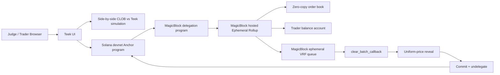

# Teek Architecture

## State flow

1. The browser creates or loads a local devnet demo wallet.
2. The user deposits demo tokens into a `TraderAccount` PDA.
3. `delegate_trader_account` delegates the trader balance PDA.
4. `delegate_accounts` delegates the market, order book, and reveal accounts.
5. Orders route through `ConnectionMagicRouter` to the hosted ER.
6. `clear_batch` requests ephemeral VRF randomness.
7. The oracle invokes `clear_batch_callback` asynchronously.
8. The callback runs uniform-price clearing, writes `Reveal`, unlocks balances, and rolls the book to the next batch.
9. `commit_and_undelegate` settles state back to devnet.

## Why MagicBlock is required

A normal Solana L1 demo can settle a batch, but it cannot make high-frequency batched order submission feel live. Teek needs delegated real-time state, cheap repeated writes, asynchronous VRF callbacks, and fast commit/undelegate semantics. Those are the core MagicBlock primitives, not decorative integrations.
